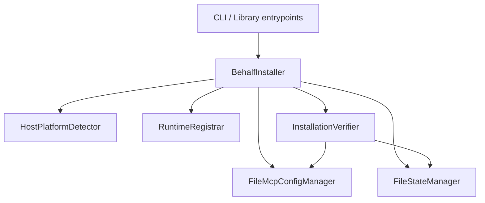
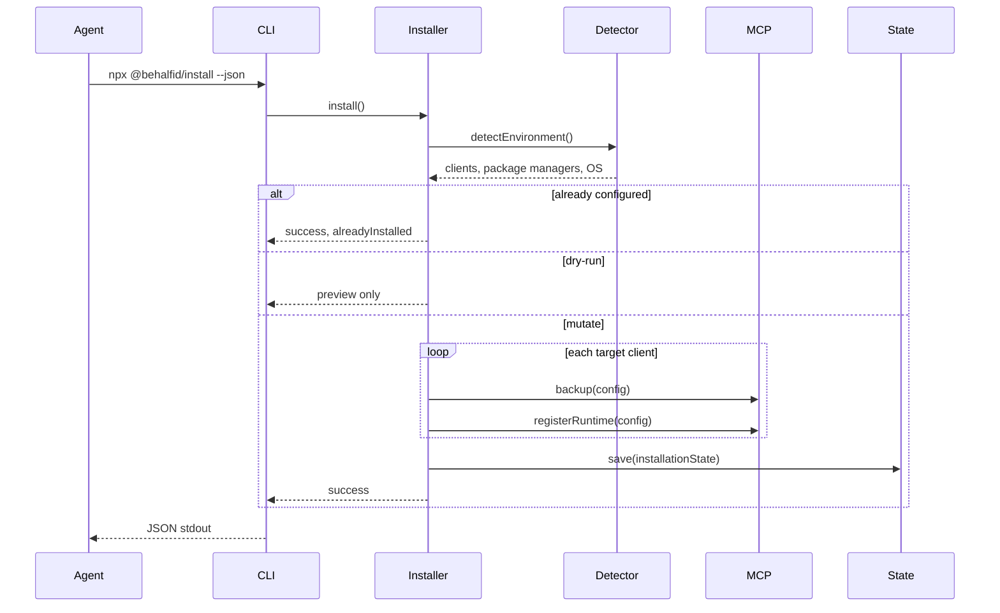

# Architecture

This document describes how `@behalfid/install` is structured, how the install lifecycle works, and where each responsibility lives.

## Design goal

AI coding agents should never embed BehalfID-specific installation logic. They invoke the official installer, parse JSON output, and report results to the user. The installer owns:

- Platform and client detection
- MCP configuration read/write with backup and rollback
- Runtime registration
- Installation state persistence
- Health verification (`doctor`)
- Upgrade and uninstall lifecycle

## High-level components



| Component | Role |
| --- | --- |
| `BehalfInstaller` | Orchestrates install, upgrade, uninstall, doctor, and status |
| `HostPlatformDetector` | Read-only detection of OS, package managers, and AI clients |
| `FileMcpConfigManager` | Read/write MCP configs (JSON and TOML), backup/restore, register/unregister runtime |
| `RuntimeRegistrar` | Tracks registered runtimes during install (`MemoryRuntimeRegistrar` or `StateRuntimeRegistrar`) |
| `FileStateManager` | Persists installation state atomically |
| `InstallationVerifier` | Builds the machine-readable `DoctorReport` |
| `RuntimeCatalog` | Extensible registry of runtime definitions (default: `@behalfid/mcp-runtime`) |
| `InstallTransaction` | Backup stack and rollback on failure |

All collaborators are injected into `BehalfInstaller`, so tests and integrations can swap implementations without changing the orchestrator.

## Install lifecycle



On failure after one or more configs were backed up, `InstallTransaction.rollback()` restores files in reverse order and no state file is written.

## Installation state

State is stored at:

```text
~/.behalfid/install-state.json
```

Override the directory with `BEHALF_HOME` (useful in tests or custom layouts).

The state file records:

| Field | Purpose |
| --- | --- |
| `installedVersion` | Runtime/package version installed |
| `installerVersion` | Version of `@behalfid/install` that last wrote state |
| `installedAt` | ISO timestamp of first install (preserved across upgrades) |
| `updatedAt` | ISO timestamp of last mutation |
| `configuredClients` | Per-client records (id, MCP config path, format) |
| `registeredRuntimes` | Runtime ids, package names, versions, metadata |

State is written only after all MCP configs succeed. Reads and writes use atomic file replacement to avoid corruption on interrupt.

## Supported clients and config paths

Detection is read-only. A client is considered installed when known config directories or MCP files exist on disk (or, for some clients, when the application binary is on PATH or in a standard install location).

| Client | Primary MCP config | Format |
| --- | --- | --- |
| Cursor | `~/.cursor/mcp.json` | `mcpServers-json` |
| Claude Code | `~/.claude.json` or `<project>/.mcp.json` | `mcpServers-json` |
| Claude Desktop | OS-specific `claude_desktop_config.json` | `mcpServers-json` |
| Codex CLI | `~/.codex/config.toml` | `codex-toml` |
| VS Code | `<workspace>/.vscode/mcp.json` | `vscode-json` |
| Windsurf | `~/.codeium/windsurf/mcp_config.json` | `mcpServers-json` |

Claude Desktop paths:

- **macOS:** `~/Library/Application Support/Claude/claude_desktop_config.json`
- **Linux:** `~/.config/Claude/claude_desktop_config.json`
- **Windows:** `%APPDATA%\Claude\claude_desktop_config.json`

VS Code also recognizes user-level `.../Code/User/mcp.json` when present.

## MCP configuration formats

| Format | Server map key | Used by |
| --- | --- | --- |
| `mcpServers-json` | `mcpServers` | Cursor, Claude Code, Claude Desktop, Windsurf |
| `vscode-json` | `servers` | VS Code workspace/user MCP config |
| `codex-toml` | `mcp_servers` | Codex CLI |

The config manager:

- Preserves unrelated keys and servers
- Replaces an existing BehalfID entry on `--force` or upgrade
- Skips duplicate registration when already configured (idempotent install)
- Backs up the file before any write

Default MCP server name: `behalfid` (`BEHALF_MCP_SERVER_NAME`).

Default runtime registration:

```json
{
  "command": "npx",
  "args": ["-y", "@behalfid/mcp-runtime@<version>"],
  "env": {
    "BEHALFID_VERIFY_URL": "https://behalfid.com/api/verify",
    "BEHALFID_BASE_URL": "https://behalfid.com"
  }
}
```

## Doctor verification

`InstallationVerifier` produces a `DoctorReport` with:

- **Installer version** — package version of `@behalfid/install`
- **Installation state** — presence and validity of state file
- **Runtime installed** — runtimes recorded in state
- **MCP registration** — per-client check that `behalfid` exists in MCP config
- **Configuration integrity** — server entry has a valid `command`
- **Verify endpoint** — HTTP probe of the configured verify URL
- **Package versions** — installer and registered runtime packages

`healthy` is `true` when no check has status `fail`. Warnings (for example, not installed) do not fail health by themselves unless paired with a hard failure.

## CLI surface

Binary: `behalf-install` (via `npx @behalfid/install`).

| Command | Notes |
| --- | --- |
| `install` | Default command when no subcommand is given |
| `doctor` | Exits with code `1` when `healthy === false` |
| `upgrade` | Re-registers runtime at new version; preserves `installedAt` |
| `uninstall` | Removes BehalfID MCP entries; optional `--keep-state` |
| `status` | Reads state only; does not mutate configs |

All commands support `--json` for machine-readable output on stdout.

## Error handling

Operations return `{ success, errors[], warnings[] }` rather than throwing to callers. Internal failures use `InstallerException` with stable `InstallerErrorCode` values, then convert to serializable `InstallerError` objects.

Config mutations always go through backup first. Rollback failures are appended to `errors` with code `ROLLBACK_FAILED`.

See [TROUBLESHOOTING.md](./TROUBLESHOOTING.md) for operator-facing guidance on common error codes.

## Testing strategy

| Layer | Location | Focus |
| --- | --- | --- |
| Unit | `test/*.test.ts`, `test/mcp/`, etc. | Individual collaborators |
| Integration | `test/integration/` | Full stack against temp filesystem fixtures |
| CLI | `test/cli/` | Commander wiring, JSON output, exit codes |

Integration tests cover fresh install, idempotent re-install, upgrade, uninstall, rollback, malformed config, multi-client detection, and doctor/CLI JSON output.

## Related documents

- [EXTENSION.md](./EXTENSION.md) — adding clients and runtimes
- [TROUBLESHOOTING.md](./TROUBLESHOOTING.md) — common failures and fixes
- [../INSTALL_FOR_AI.md](../INSTALL_FOR_AI.md) — deterministic instructions for AI agents
- [../spec/behalfid-install.spec.yaml](../spec/behalfid-install.spec.yaml) — machine-readable command contract
